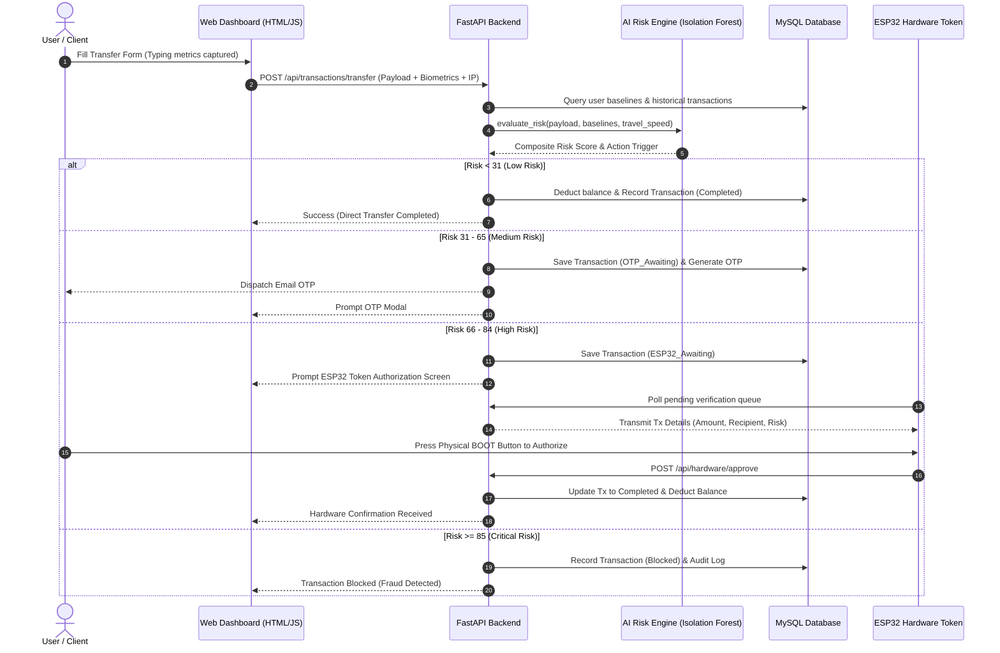

# CyberForge — Adaptive AI-Driven Banking Fraud Prevention & Hardware Sentinel 

[](https://fastapi.tiangolo.com)
[](https://www.python.org/)
[](https://www.espressif.com/)
[](https://www.mysql.com/)
[](LICENSE)

**CyberForge** (also known as *Banking Sentinel*) is an end-to-end intelligent fraud prevention system and adaptive multi-factor authentication (MFA) banking suite. It combines multi-dimensional behavioral biometrics, machine learning anomaly detection (Isolation Forest), automated OTP escalation, and an out-of-band physical **ESP32 hardware security token** with physical push-button transaction authorization.

---

## 📑 Table of Contents

- [Key Architecture & Features](#-key-architecture--features)
- [Multi-Tier Risk Engine (8 Dimensions)](#-multi-tier-risk-engine-8-dimensions)
- [Adaptive Action Tiers](#-adaptive-action-tiers)
- [ESP32 Hardware Security Token](#-esp32-hardware-security-token)
- [System Architecture & Flow](#-system-architecture--flow)
- [Project Directory Structure](#-project-directory-structure)
- [Prerequisites & Setup](#-prerequisites--setup)
  - [1. Backend Setup](#1-backend-setup)
  - [2. Frontend Setup](#2-frontend-setup)
  - [3. Hardware Setup (ESP32)](#3-hardware-setup-esp32)
- [API Endpoints Reference](#-api-endpoints-reference)
- [Security Features](#-security-features)
- [Defense / Academic Guide](#-defense--academic-guide)

---

## Key Architecture & Features

- 🧠 **Multi-Layered AI Risk Engine**: Evaluates 8 independent behavioral and context dimensions, boosted by an Isolation Forest ML model and Impossible Travel speed verification.
- 🔐 **Zero-Friction Dynamic Step-Up MFA**: Automatically scales authentication demands based on risk scoring (Direct approval $\to$ 2FA Email OTP $\to$ Out-of-Band Physical ESP32 Hardware Approval $\to$ Hard Block).
- 🔑 **Keystroke & Behavioral Biometrics**: Captures flight time, dwell time, and inter-keystroke speed metrics to detect unauthorized account access and bot submissions.
- 📡 **Impossible Travel Detection**: Uses Haversine calculations against IP geolocation coordinates to detect suspicious location changes across short time intervals.
- 📟 **Out-of-Band Hardware Token (ESP32)**: WiFi-connected ESP32 controller featuring an I2C SSD1306 OLED display and physical cryptographic verification button for critical/high-risk transfers.
- 🔒 **Data Protection & Compliance**: SHA-256 / bcrypt password & PIN hashing, Fernet symmetric encryption for PII (email addresses), and immutable audit trail logging.
- 📊 **Real-time Banking Dashboard**: Interactive client interface for simulated funds transfer, live risk visualizers, transaction histories, and security configuration.

---

## Multi-Tier Risk Engine (8 Dimensions)

The composite risk score ($0 - 100$) is computed across 8 weighted behavioral and environmental factors:

| Dimension | Weight | Description |
| :--- | :---: | :--- |
| **Location Anomaly** | `15%` | Checks IP familiarity and impossible physical travel speed (km/h) between consecutive transactions. |
| **Device Trust** | `15%` | Inspects browser fingerprint, user agent consistency, and device recognition. |
| **Typing Biometrics** | `12%` | Evaluates keystroke latency and typing speed against the user's historical baseline profile. |
| **Amount Deviation** | `18%` | Compares transaction amount deviation against baseline historical averages. |
| **Time-of-Day** | `10%` | Flags anomalous transaction execution times outside standard activity patterns. |
| **Transaction Velocity** | `12%` | Monitors rapid burst transfers in the last 1 hour and 24 hours. |
| **Recipient Familiarity** | `10%` | Assesses risk based on previous successful transfers to the destination account. |
| **Amount-to-Balance Ratio** | `8%` | Measures the proportion of account liquidity being drained in a single transfer. |

> **ML Anomaly Amplifier**: An **Isolation Forest** model evaluates the multidimensional feature vector to detect complex non-linear anomaly combinations.

---

##  Adaptive Action Tiers

Based on the calculated composite risk score ($0 - 100$), the system dynamically triggers one of four security decisions:

```
 Composite Risk Score
  │
  ├─► [ 0  -  30 ]  ──────►  ALLOW (Instant Transfer Processed)
  │
  ├─► [ 31 -  65 ]  ──────►  OTP_REQUIRED (Step-Up 2FA Email Code Verification)
  │
  ├─► [ 66 -  84 ]  ──────►  ESP32_REQUIRED (Out-of-Band Physical Hardware Approval)
  │
  └─► [ 85 - 100 ]  ──────►  BLOCK (Immediate Decline + Fraud Alert Logged)
```

---

##  ESP32 Hardware Security Token

For high-risk transactions ($66 - 84$), CyberForge escalates verification to a dedicated, physically isolated ESP32 hardware device:

- **Display**: 0.96" I2C OLED (SSD1306, $128 \times 64$) displaying transfer details (Amount, Recipient, Risk Score).
- **Physical Verification**: Utilizes the onboard **BOOT** button (GPIO 0) — requires physical human presence to approve or reject the transfer.
- **Protocol**: Communicates over WiFi directly with the FastAPI backend via REST polling / heartbeat.

```
OLED Display (SSD1306)          ESP32 Board (NodeMCU / WROOM)
──────────────────────          ─────────────────────────────
         VCC          ───────►  3.3V (3V3)
         GND          ───────►  GND
         SDA          ───────►  GPIO 19 (D19)
         SCL          ───────►  GPIO 22 (D22)
```

---

##  System Architecture & Flow



---

## Project Directory Structure

```plaintext
cyberforge/
│
├── backend/
│   ├── ai_engine/
│   │   ├── models/
│   │   │   └── risk_model.pkl       # Trained Isolation Forest model
│   │   ├── predictor.py             # 8-Dimension composite AI risk engine
│   │   └── train_model.py           # Training pipeline for ML model
│   ├── auth.py                      # Password hashing & PII Fernet encryption
│   ├── database.py                  # SQLAlchemy engine & MySQL connection
│   ├── main.py                      # FastAPI application routes & logic
│   ├── models.py                    # Database schema models (Users, Tx, Logs)
│   ├── otp_service.py               # Cryptographic OTP generation & EmailJS service
│   ├── schemas.py                   # Pydantic request/response schemas
│   ├── update.py                    # Database migration & schema patch utility
│   └── requirements.txt             # Python dependencies
│
├── frontend/
│   ├── index.html                   # Login & registration portal
│   ├── dashboard.html               # Account overview, stats & quick actions
│   ├── transfer.html                # Money transfer interface with biometrics
│   ├── style.css                    # Modern cyber-banking design system
│   └── script.js                    # Biometric listeners, API client & UI logic
│
├── hardware/
│   ├── cyberforge_token.ino         # Arduino C++ sketch for ESP32 & OLED
│   └── README.md                    # Hardware wiring and flashing documentation
│
├── generate_defense_pdf.py          # ReportLab script generating viva defense guide
├── CyberForge_Demonstration_Defense_Guide.pdf
└── README.md
```

---

##  Prerequisites & Setup

### Prerequisites

- **Python**: 3.9+ installed
- **MySQL**: 8.0+ running locally or remotely
- **Arduino IDE 2.x** (for hardware token flashing)
- **Node/HTTP Server** or Live Server (to serve frontend files)

---

### 1. Backend Setup

1. **Navigate to the backend directory**:
   ```bash
   cd backend
   ```

2. **Create and activate a virtual environment**:
   ```bash
   # Windows
   python -m venv venv
   venv\Scripts\activate

   # Linux / macOS
   python3 -m venv venv
   source venv/bin/activate
   ```

3. **Install dependencies**:
   ```bash
   pip install -r requirements.txt
   ```

4. **Configure Environment Variables**:
   Create or edit `backend/.env`:
   ```env
   DB_USER=root
   DB_PASSWORD=your_mysql_password
   DB_HOST=localhost
   DB_PORT=3306
   DB_NAME=cyberforge_db

   EMAILJS_SERVICE_ID=your_emailjs_service_id
   EMAILJS_TEMPLATE_ID=your_emailjs_template_id
   EMAILJS_PUBLIC_KEY=your_emailjs_public_key
   EMAILJS_PRIVATE_KEY=your_emailjs_private_key
   SECRET_KEY=your_generated_fernet_key
   ```

5. **Train the ML model (Optional if `.pkl` already exists)**:
   ```bash
   python ai_engine/train_model.py
   ```

6. **Start the FastAPI server**:
   ```bash
   uvicorn main:app --reload --host 0.0.0.0 --port 8000
   ```
   The API will be live at `http://localhost:8000` (Interactive docs: `http://localhost:8000/docs`).

---

### 2. Frontend Setup

The frontend consists of vanilla HTML5, CSS3, and modern JavaScript.

You can serve it with any local static server:
```bash
# Using Python
cd frontend
python -m http.server 3000

# Or using npx serve
npx serve frontend -l 3000
```
Open `http://localhost:3000` in your web browser.

---

### 3. Hardware Setup (ESP32)

1. Open `hardware/cyberforge_token.ino` in **Arduino IDE**.
2. Install the required libraries in Arduino IDE (**Sketch $\to$ Include Library $\to$ Manage Libraries**):
   - `Adafruit SSD1306`
   - `Adafruit GFX Library`
   - `ArduinoJson` (v6 or v7)
3. Set your WiFi credentials and Backend IP address in `cyberforge_token.ino`:
   ```cpp
   const char* ssid = "YOUR_WIFI_SSID";
   const char* password = "YOUR_WIFI_PASSWORD";
   const char* serverUrl = "http://YOUR_LAPTOP_IP:8000";
   ```
4. Connect the ESP32 board via USB, select your board (`ESP32 Dev Module`) and COM port, then click **Upload**.
5. Detailed wiring and troubleshooting instructions are available in [hardware/README.md](hardware/README.md).

---

##  API Endpoints Reference

| Method | Endpoint | Description |
| :--- | :--- | :--- |
| `POST` | `/api/auth/register` | Register a new user with encrypted PII and baseline balance. |
| `POST` | `/api/auth/login` | Authenticate user credentials and return user profile. |
| `DELETE` | `/api/users/{user_id}` | Delete user account and all associated data. |
| `POST` | `/api/transactions/transfer` | Core transfer endpoint; evaluates AI risk and returns required action. |
| `POST` | `/api/transactions/verify-otp` | Verifies 2FA Email OTP code for medium-risk transactions. |
| `GET` | `/api/transactions/history/{user_id}` | Fetch transaction logs and risk scores for a user. |
| `GET` | `/api/hardware/pending` | ESP32 polling route to check for transactions awaiting token approval. |
| `POST` | `/api/hardware/approve` | Approves an awaiting transaction via hardware token physical button. |
| `POST` | `/api/hardware/reject` | Rejects an awaiting transaction from the hardware token. |
| `GET` | `/api/analytics/risk-metrics` | Aggregated security and risk distribution analytics. |

---

##  Security Features

- **Fernet Symmetric Encryption**: PII (emails) encrypted at rest in the database.
- **Salted Hashing**: Passwords and transaction PINs hashed using standard cryptographic algorithms.
- **Impossible Travel & Speed Analytics**: Prevents remote account takeovers and session hijacking from different geographical IP locations.
- **Out-of-Band Hardware Authorization**: Protects against Man-in-the-Browser (MitB) and session compromise by demanding physical hardware confirmation on a separate network device.
- **Tamper-Evident Audit Logging**: Every transaction decision, risk breakdown, and trigger reason is committed to immutable audit logs.

---

##  Defense & Academic Demonstration

A comprehensive evaluation and viva defense document generator is included in the project:
```bash
python generate_defense_pdf.py
```
This generates `CyberForge_Demonstration_Defense_Guide.pdf`, which contains in-depth mathematical breakdowns, architectural justification, examiner Q&A answers, and step-by-step live demo execution flows.

---

##  License

This project is licensed under the MIT License — see the [LICENSE](LICENSE) file for details.
